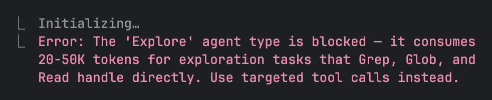

# claude-token-guard

A Claude Code plugin that cuts token burn on every session via two `PreToolUse` hooks.

No Node.js. No build step. Pure Python 3 stdlib.

---

## What it does

### 1. Agent Guard

Blocks expensive agent types before they consume 20–50K tokens on tasks that `Grep`, `Glob`, and `Read` handle in under 500:

| Blocked | Reason |
|---|---|
| `subagent_type: "Explore"` | Broad codebase exploration — use `Grep`/`Glob` directly |
| `subagent_type: "Plan"` | Planning agents — use `EnterPlanMode` instead |
| `description` starts with `"research"` | Open-ended research — use `WebFetch` or targeted reads |

Claude gets a clear error message explaining what to use instead, so it self-corrects.



### 2. Bash Trimmer

Silently rewrites verbose Bash commands to token-efficient equivalents before they run:

| Original | Rewritten to |
|---|---|
| `git log` | `git log --oneline -20` (limit configurable via `CLAUDE_TOKEN_GUARD_GIT_LOG_LIMIT`) |
| `npm list [flags]` | `npm list [flags] --depth=0` (existing flags preserved) |
| `yarn list [flags]` | `yarn list [flags] --depth=0` (existing flags preserved) |
| `pip list` | `pip list --format=columns` |
| `docker images` | columnar format (repo, tag, size) |
| `docker ps` | columnar format (name, status, ports) |
| `mvn test\|verify\|install` | appends `-q` |
| `go test ... -v ...` | pipes to `tail -100` |
| `pytest ...` | `pytest ... -q --tb=short` |
| `python -m pytest ...` | `python -m pytest ... -q --tb=short` |
| `./gradlew <task>` | `./gradlew <task> --quiet` |

Rules are skipped if the relevant flags are already present. `gradlew tasks/dependencies/help/properties/projects` are excluded (their output is the point).

Set `CLAUDE_TOKEN_GUARD_BYPASS=1` to skip all rewrites for a single invocation.

---

## Installation

### Claude Code plugin (recommended)

```bash
# Add the marketplace (once)
claude plugin marketplace add rezaiyan/claude-plugins

# Install
claude plugin install claude-token-guard@rezaiyan
```

### Project scope (shared team repo)

Run once, commit `.claude/settings.json` — teammates just need the second line after cloning:

```bash
# One-time setup
claude plugin marketplace add rezaiyan/claude-plugins --scope project

# Everyone on the team
claude plugin install claude-token-guard@rezaiyan
```

### Manual

> ⚠️ Manual installs must be removed manually — `claude plugin uninstall` won't clean up hooks added directly to `settings.json`.

Copy `hooks/agent_guard.py` and `hooks/bash_trimmer.py` anywhere, then add to `~/.claude/settings.json`:

```json
{
  "hooks": {
    "PreToolUse": [
      {
        "matcher": "Agent",
        "hooks": [{ "type": "command", "command": "python3 /path/to/agent_guard.py" }]
      },
      {
        "matcher": "Bash",
        "hooks": [{ "type": "command", "command": "python3 /path/to/bash_trimmer.py" }]
      }
    ]
  }
}
```

### Verify the hooks are wired up

```bash
python3 /path/to/agent_guard.py --check
python3 /path/to/bash_trimmer.py --check
```

Each prints a status line and exits 0 if the hook is reachable.

---

## Customising

**Change the guard mode** — set `AGENT_GUARD_MODE` in your environment or inline in the hook command:

| Mode | Behaviour |
|---|---|
| `block` (default) | Hard block — Claude cannot proceed |
| `warn` | Prints a bold warning to stderr, Claude proceeds anyway |
| `ask` | Interactive prompt in the terminal, you decide per-invocation |

```bash
# Shell (persistent)
export AGENT_GUARD_MODE=warn   # or: ask

# Or inline in settings.json hook command:
"command": "AGENT_GUARD_MODE=ask python3 \"${CLAUDE_PLUGIN_ROOT}/hooks/agent_guard.py\""
```

In `ask` mode the prompt appears directly in your terminal with a bold warning and a `[y/N]` confirmation. Falls back to `block` when no TTY is available (e.g. CI).

**Block additional agent types** — set `CLAUDE_TOKEN_GUARD_EXTRA_BLOCKED` (comma-separated):

```bash
export CLAUDE_TOKEN_GUARD_EXTRA_BLOCKED=general-purpose,codex
```

**Tune the git log limit:**

```bash
export CLAUDE_TOKEN_GUARD_GIT_LOG_LIMIT=50
```

**Skip rewrites for one command:**

```bash
CLAUDE_TOKEN_GUARD_BYPASS=1 git log  # full output, no rewrite
```

**Add more Bash trim rules** — append to `TRIM_RULES` in `bash_trimmer.py`:
```python
(r"^my-tool$", lambda m: "my-tool --quiet"),
```

---

## Savings reporting

Every rewrite and block is logged to `~/.claude/token-guard-stats.jsonl`. Each line is a JSON object:

```json
{"ts": "2026-04-22T10:00:00", "hook": "bash_trimmer", "action": "rewrite", "detail": "'npm list -g' → 'npm list -g --depth=0'"}
{"ts": "2026-04-22T10:01:00", "hook": "agent_guard",  "action": "block",   "detail": "Explore"}
```

Quick summary:

```bash
# Count by hook and action
jq -r '"\(.hook) \(.action)"' ~/.claude/token-guard-stats.jsonl | sort | uniq -c | sort -rn
```

---

## Uninstalling

```bash
claude plugin uninstall claude-token-guard@rezaiyan
```

If you set `AGENT_GUARD_MODE` or other env vars in `settings.json`, remove them manually from the `"env"` block — uninstalling the plugin does not touch environment configuration.

After uninstalling, the `rezaiyan/claude-plugins` marketplace entry stays in `settings.json`. Remove it manually if you want a fully clean state:

```json
// Remove this from extraKnownMarketplaces in settings.json:
{ "name": "rezaiyan/claude-plugins", ... }
```

---

## Requirements

- Claude Code with plugin support
- Python 3.8+

---

## License

MIT

---

## More Claude tools by rezaiyan

| Plugin | Description | Install |
|--------|-------------|---------|
| [claude-notifier](https://github.com/rezaiyan/claude-notifier) | Desktop notifications when Claude finishes or needs input (macOS + Linux) | `claude plugin install claude-notifier@rezaiyan` |
| [skillfetch](https://github.com/rezaiyan/skillfetch) | Sync AI skill instructions from GitHub repos — security-scanned, diff-previewed | `claude plugin install skillfetch@rezaiyan` |
| [claude-session-manager](https://github.com/rezaiyan/claude-session-manager) | Desktop app for running multiple Claude Code sessions side by side | — |
